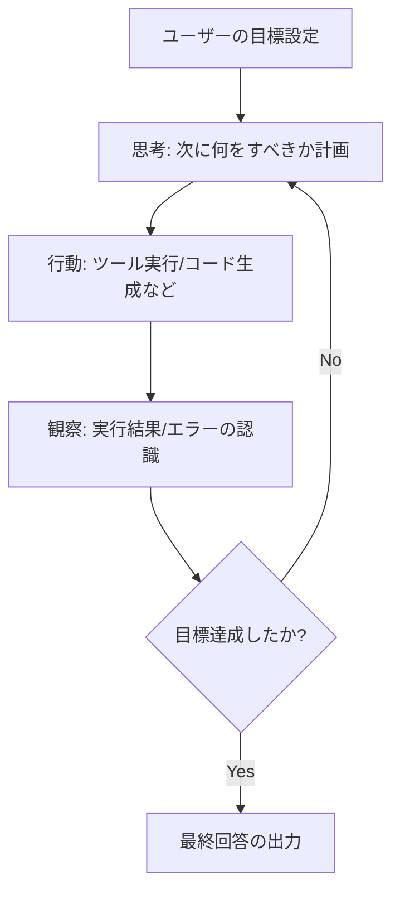

---
tags:
  - concept
  - agents
---
# AI Agents (AI エージェント)

## 📝 概要
AI エージェントとは、単にユーザーの入力に対して応答を返すだけのLLM（対話型AI）とは異なり、**「自律的に環境を認識し、思考し、ツールを使って行動を繰り返す」** サイクルを持ったシステムです。

従来の LLM チャットが「一問一答」であるのに対し、エージェントは「与えられた目標に向けて、複数ステップの作業を自律的に繰り返す」という特徴があります。

## ⚙️ エージェントのコア・サイクル
エージェントは一般的に、以下のサイクル（ReAct パターンなど）で自律実行を行います。

## 🧩 エージェントを構成する4つの要素
1. **思考 (Planning)**: タスクを分解し、どの順番で処理を行うか決定する（Vertex AI や Gemini の推論力）。
2. **記憶 (Memory)**: 
   - 短期記憶: 会話のコンテキスト（チャット履歴）。
   - 長期記憶: プロジェクトのルール（[[03_Guides/Prompt Engineering#AGENTS.md の役割と配置|AGENTS.md]] などによる永続コンテキスト）。
3. **道具 (Tools)**: 外部環境へ影響を与える手段（ファイルの読み書き、シェル実行、[[Model Context Protocol (MCP)|MCP サーバ]] を介した API 連携）。
4. **自律制御 (Control Flow)**: 実行前のチェックや事後処理を行う ([[Agent Hooks|Hooks]] など）。

## 🔗 関連リンク
- [[Model Context Protocol (MCP)]]
- [[Agent Skills]]
- [[Agent Hooks]]
- [[Sub-agents]]
