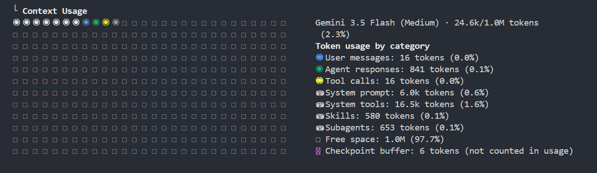
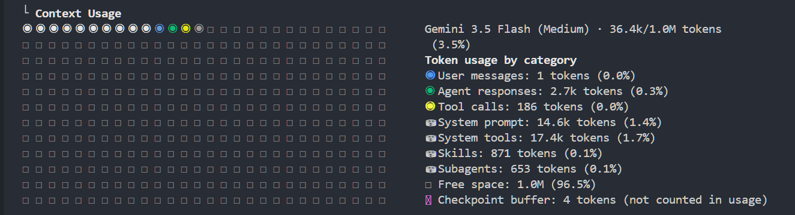
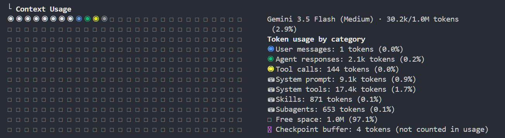
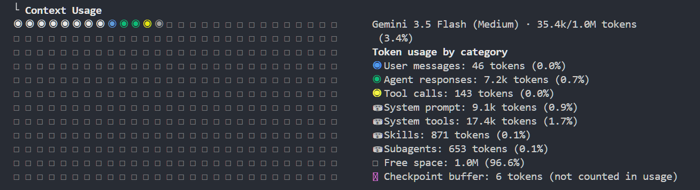

# 第1回. AI Agent の全体像 + コンテキスト管理
## AIエージェントの基本とコンテキストの扱い方を掴む

<!--
ではAI Agentのワークショップということで、第1回をはじめていきたいと思います。
WS事業部福岡支社グループの坂本です。
よろしくお願いします。
第1回は、AI Agentの基本的なところと、コンテキスト管理についてお話しできればと思います。
-->

---

## ワークショップ全体のロードマップ

<style scoped>
table { font-size: 22px; }
td, th { padding: 8px 12px; }
</style>

| # | テーマ | 概要 |
|---|---|---|
| **第1回** | **AI Agent の全体像 + コンテキスト管理** | エージェントの基本とコンテキスト管理を掴む |
| 第2回 | Skills | よく使う手順を再利用する |
| 第3回 | MCP | AI のできることを増やす |
| 第4回 | Subagents | 重い作業を別の頭脳に任せる |

<!--
まずはワークショップ全体の構成を紹介できればと思います。
今回は第1回ということで、AI Agentの基本とコンテキスト管理について扱っていきます。
第2回以降はSkill, MCP, Subagentsについての解説と、それぞれがコンテキストに対してどう影響するかを見ていきます。
-->

---

## 本日のフロー

1. AI Agent (Coding Agent) とは何か
2. Antigravity CLI (前Gemini CLI) セットアップ・デモ
3. コンテキスト管理とは何か
4. `AGENTS.md` 設計 + プロンプト設計
5. ハンズオン
6. まとめ

<!--
本日のフローです。
まずはAI Agent,Coding Agentとは何かというところを軽く見てから、
今回のワークショップで使用していくAntigravity CLIのセットアップを進めていきます。
その後はコンテキスト管理とはなにか、AGENTS.mdの設計、プロンプト設計について見て、
ハンズオンとして実際に軽く触っけいければと思います。
 -->

---

## このセッションのゴール

1. AI Agent (Coding Agent) とは何かを説明できる
2. Antigravity CLI (他ツール可) をセットアップし、基本操作を体験する
3. コンテキスト管理がもたらす効果を知り、`AGENTS.md` でルールを設定できる
4. プロンプト改善で消費トークンを削減できる

<!-- 
このセッションのゴールとしてはAgentとは何かがわかるということと、
実際にエージェントツールを使えるようになるところ、
あとはコンテキスト管理がどんな効果があるのか、プロンプトの改善でトークンを効率的に使えるようになれるところを目標にしています。
 -->

---

## AI Agent とは

AI Agent = **LLM（頭脳）+ ツール呼び出し + 自律ループ** の3要素

- **LLM（頭脳）** — 推論・判断の中心。次に何をすべきか考える
  - GPT-5.6 、Claude Sonnet 5 などのモデル
- **ツール呼び出し** — ファイル編集・コマンド実行・API 呼び出しで外部環境と連携する
- **自律ループ** — 一度の応答で終わらず、完了するまで複数ステップを反復する

<!--
さっそくAI Agentとはなんなのかというところについてですが、
よく表現されるものとしてはLLMが判断して、ツールの呼び出し、自律的にループするという3つの要素を持っているものをAI Agentといわれたりします。
LLMはGPT-5.6とかClaude Sonnet 5 などのモデルのことで、このモデルの賢さが大きく影響してきます。
ツールの呼び出しに関しては、LLMが考えたことを実際にアウトプットするためにファイルの編集やコマンドを実行したりする。
最後自律ループについては、1回の指示に対して1回の実行だけではなく、与えられた指示を完了するために反復していろんなツールを呼び出しつつ遂行していくというところになります。
-->

---

## LLM と AI Agent の違い

<style scoped>
table {
  font-size: 24px;
}
td, th {
  padding: 6px 10px;
}
</style>

| | LLM | AI Agent |
|---|---|---|
| 入力 | 渡された情報（テキスト・画像など） | ＋ ファイルや会話履歴等 に自らアクセス |
| 出力 | テキスト | ファイル編集・コマンド実行・API 呼び出し |
| ループ | 単発 | 完了まで複数ステップ自律反復 |
| 検証 | 人間がやる | 自分でテスト・lint を実行 |

**LLM ＝ 聞いたことに答えてくれる**
**AI Agent ＝ 頼んだことをやり遂げてくれる**

<!-- 
LLMとAI Agentの違いというところでもう少し細かく見ていくと、
入力についてはLLMは渡された情報だけで、エージェントは自らファイルにアクセスして情報を探しに行ったり、
出力はLLMはテキストでレスポンスを返すだけですが、エージェントは実際にファイル出力したりコマンド実行したりとコーディング作業的なところまで行ってくれます。
先ほども説明したようにLLMはループがなくて単発のやり取りで終わりますが、エージェントは自律的に複数ステップで完了まで反復して作業を繰り返してくれます。
検証に関しては必ずしもこうではないですが、LLMは出力するだけなので必ず人間がやるしかなくて、エージェントは自分でテストコマンドなどを実行できるので、最低限のチェックをすることはできます。
簡単にまとめると、LLMは聞いたことに答えてくれる、エージェントは頼んだことを最後までやり遂げてくれる、というような違いがあるということになります。
 -->

---

##  AI エージェントの主要リスクと対策

<style scoped>
ul, p {
  font-size: 20px;
  line-height: 1.45;
}
</style>

エージェントは自律的に動くため、チャット型のLLMとは異なるリスクが存在する。

- 破壊的実行のリスク — 不用意な `rm -rf` やコード・環境の意図しない書き換え
  - 対策: コマンド実行前の人間による手動承認、サンドボックス環境の利用
- 機密情報の流出 — `.env` や秘密鍵などのデータを外部 LLM に送信してしまう
  - 対策: エージェント用の読み込み除外ファイル（`.gitignore` 等）の適切な設定
- 間接的プロンプトインジェクション — 読み込ませた外部のWebやファイルに仕込まれた指示の実行
  - 対策: 未信頼の外部データを処理させる際のアクション監視
- 無限ループと課金爆発 — エラー修復の無限ループによる API トークンの大量消費
  - 対策: 最大ループ回数（Max Iterations）や予算リミットの設定
- ブラックボックス化 — 動作原理を理解しないままコード変更を承認し続ける
  - 対策: レビューを省略せず、エージェントに変更理由を説明させる

<!-- 
エージェントは自律的に動いてくれるところがメリットではありますが、チャット型のLLMとは違ったリスクがあります。
エージェントはコマンドを実行できるので、ファイル削除や環境の書き換えなどを意図しないところで行ってしまうような破壊的な行動であったり、
ファイルを自律的に読みに行くので機密除法が知らない間に読まれて流出したり、
外部ファイルに悪意のあるプロンプトが組み込まれていて意図していない指示を受け取ったり、
後は料金面についてですが、ループして自律的に動くので、従量課金にしていると知らない間に課金がものすごいことになっていたり、
エージェントを使う人が実際に直截コードを書かなくなるというところで、コードがブラックボックス化してなんで動いているのかわからないというような問題も発生したりします。

これらのリスクに対応するために、サンドボックス環境をつかったり、予算に応じてリミットを決めたり、生成したコードをしっかりレビューしたりする必要があります。
 -->

---

## 本ワークショップでは Antigravity CLI を使う

1. 無料枠 — 参加者全員が同じ条件で触れる
2. 準備が簡単 — Google アカウントのみ
3. SKILL / MCP / Subagents の概念は共通 — 他にも応用が効く

<!--
本ワークショップではちょっと使っている人があんまりいないかもしれないですが、 Antigravity CLIを使っていきます。
理由としては書いてあるとおりですが、誰でも参加しやすいようにというところで無料枠でもそれなりに動かせるところ、
Googleアカウントがあれば準備が簡単なところ、
あとのセッションで解説するSkillやMCPｙはSubagentsの概念はCodexやClaude Codeとかの他のエージェントでも同じなので、
それぞれ好きなものに適用していただければと思います。
-->

---

## セットアップ

```bash
# インストール
curl -fsSL https://antigravity.google/cli/install.sh | bash

# 初回起動 (Google アカウントでログイン)
agy
```

<!-- 
セットアップとしてはコマンド実行するだけなので
今回実際に動かしながら見ていきたい方はインストールしてみてください。
agyで起動して個人のプライベートのアカウントででもログインしていただければと思います。
 -->

---

## デモ

「`hello.sh` を作って `Hello, agent!` を出力させて。実行して確認して」

→ ファイル編集・コマンド実行・自己検証を一連の流れで確認する

<!-- 
とりあえず初回の実行というところで簡単に確認してみましょう。
 -->

---

# コンテキスト管理とは

---

## コンテキスト = エージェントが見えている情報

- コンテキストとはエージェントが応答を生成する時に参照している入力全体
- コンテキストに収まる入力の上限がコンテキストウィンドウ
- エージェントは毎回コンテキストウィンドウの中身を読んで推測している

---

## コンテキストの中身と構造

<style scoped>
.cw-cap { text-align: center; font-size: 18px; font-weight: bold; color: #555; margin-bottom: 6px; white-space: nowrap; }
.main-container { display: flex; gap: 50px; align-items: center; justify-content: center; margin-top: 20px; }
.cw-box { width: 340px; border: 3px solid #333; border-radius: 6px; display: flex; flex-direction: column; overflow: hidden; }
.band { padding: 12px 14px; font-size: 17px; color: #fff; }
.b-sys  { background: #9aa0a6; flex: 0 0 auto; }
.b-hist { background: #fb8c00; flex: 1 1 auto; }
.b-proj { background: #4285f4; flex: 0 0 auto; }
.b-tool { background: #e53935; flex: 2 1 auto; }
.b-free { background: repeating-linear-gradient(45deg, #f8f9fa, #f8f9fa 10px, #e8eaed 10px, #e8eaed 20px); color: #777; flex: 1 1 auto; display: flex; align-items: center; justify-content: center; border-top: 2px dashed #999; }
table { font-size: 16px; border-collapse: collapse; }
td, th { padding: 6px 10px; border-bottom: 1px solid #ccc; }
</style>

CLIでは /contexts で確認できる

<div class="main-container">

<div>
  <div class="cw-cap">▼ ウィンドウサイズ（上限）</div>
  <div class="cw-box" style="height: 340px;">
    <div class="band b-sys">システムプロンプト・ツール定義</div>
    <div class="band b-hist">ユーザー入力・AIの応答</div>
    <div class="band b-proj">Skills・Subagents 定義</div>
    <div class="band b-tool">ツール呼び出し</div>
    <div class="band b-free">空き</div>
  </div>
</div>

<table>
  <thead>
    <tr><th>中身</th><th>具体例</th></tr>
  </thead>
  <tbody>
    <tr><td><span style="color:#9aa0a6">■</span> <b>システムプロンプト・ツール定義</b></td><td>指示・ツール定義（<code>AGENTS.md</code>含む）</td></tr>
    <tr><td><span style="color:#fb8c00">■</span> <b>ユーザー入力・AIの応答</b></td><td>過去の指示と応答</td></tr>
    <tr><td><span style="color:#4285f4">■</span> <b>Skills・Subagents 定義</b></td><td>呼び出し可能な定義の読み込み</td></tr>
    <tr><td><span style="color:#e53935">■</span> <b>ツール呼び出し</b></td><td>読込ファイル・出力等</td></tr>
  </tbody>
</table>

</div>

---

## なぜコンテキストの管理が必要なのか

コンテキストが荒れたまま作業を進めると、次のような問題が起きる。

- **無駄なトークン消費**: 不要なログやキャッシュまで読み込み、余計なコストが発生する
- **手戻りの発生**: 前提や手順が伝わらず、エラーと修正を何度も繰り返す
- **規約を無視したコード**: プロジェクト固有のルールが共有されず、一般論での実装になる

コンテキストは無駄なコスト増加を防ぎ、アウトプットの質を高めるための土台になる

---

## 対策①: 不要ファイルの除外設定

<style scoped>
pre { font-size: 16px; }
</style>

> `.env` や秘密鍵を誤って読み込ませない。トークンも節約する。

- **`.gitignore` による除外** — `agy` はデフォルトで `.gitignore` を尊重し、探索対象から除外する
- **AI 専用の除外** — グローバル設定 `~/.gemini/antigravity-cli/settings.json` の `permissions.deny` で拒否する
  ```json
  {
    "permissions": {
      "deny": ["read_file(.env)", "read_file(secrets/)"]
    }
  }
  ```

---

## 対策②: `AGENTS.md` によるルールの設定

> プロジェクトのルールをファイルに集約する

- コンテキストの提供: プロジェクト概要・技術スタック・背景
- 明確で具体的な指示: 開発用コマンド、コーディング規約、AIの振る舞い
- 例の提示: 出力形式やコードの具体例
- 構造化: Markdown見出しや区切り文字でルールを整理して記述する

**配置場所**: 
- プロジェクト固有: `.agents/AGENTS.md`
- 共通: `~/.gemini/config/AGENTS.md`

---

## `AGENTS.md` 記述例

<style scoped>
.container { display: flex; gap: 24px; }
.col { flex: 1; }
pre { font-size: 15px; line-height: 1.3; }
</style>

<div class="container">
<div class="col">

**パターン①: 直接記述**
```markdown
# calc-cli
## コーディング規約
- unittest を使用する
- 型ヒントを必須にする
## 出力フォーマット
- diff は unified format
```

</div>
<div class="col">

**パターン②: 外部ファイル参照**
```markdown
# calc-cli
- コーディング規約: docs/coding-rules.md
- 出力フォーマット: docs/output-format.md
```

**ポイント**: 役割ごとに分割すると、関係するタスクの時だけ該当ファイルが読まれる。

</div>
</div>

---

## プロンプト設計のコツ

1. **具体的に指示する** — 対象ファイルや期待する挙動を曖昧にしない
2. **十分な文脈を与える** — 背景・制約・関連ファイルを伝える
3. **出力形式を指定する** — JSON形式、HTML形式など欲しい形を明示する
4. **例を示す** — 期待するコードスタイルや出力例を1つ見せる

---

## ハンズオン: コンテキスト管理の実践

`demo/` にて、以下の2点を中心に実行・確認する。

1. **`/context` の使い方と見方**
   - 画面表示を見ながら、コンテキスト使用量の各種カテゴリの意味を理解する。
2. **`AGENTS.md` 変更による `/context` の変化**
   - 実際に `AGENTS.md` を編集し、ファイル切り出し前後でのトークン数の変化を測定する。

---

## ① /context の使い方と見方

<style scoped>
.container { display: flex; gap: 30px; align-items: center; justify-content: center; }
.col-left { flex: 1.25; text-align: center; }
.col-right { flex: 0.75; }
.legend-list { list-style: none; padding: 0; margin: 0; }
.legend-item { margin-bottom: 10px; line-height: 1.3; }
.legend-title { font-weight: bold; color: #4285f4; font-size: 17px; margin-bottom: 2px; }
.legend-desc { color: #5f6368; font-size: 15px; }
</style>

<div class="container">
<div class="col-left">



</div>
<div class="col-right">

<ul class="legend-list">
  <li class="legend-item">
    <div class="legend-title">User messages / Agent responses</div>
    <div class="legend-desc">ユーザーの入力とAIの返答（対話履歴）</div>
  </li>
  <li class="legend-item">
    <div class="legend-title">Tool calls</div>
    <div class="legend-desc">実行したツールのログと入出力データ</div>
  </li>
  <li class="legend-item">
    <div class="legend-title">System prompt / tools</div>
    <div class="legend-desc">システムプロンプト、ツール仕様、AGENTS.mdなど</div>
  </li>
  <li class="legend-item">
    <div class="legend-title">Skills / Subagents</div>
    <div class="legend-desc">登録されたスキル定義と起動中のサブエージェント</div>
  </li>
  <li class="legend-item">
    <div class="legend-title">Free space</div>
    <div class="legend-desc">コンテキストウィンドウ内の残りの空き容量</div>
  </li>
</ul>

</div>
</div>

---

## ② 測定比較：無関係なタスクの場合 (hello)

<style scoped>
section { padding: 40px 40px; }
.container { display: flex; gap: 20px; align-items: flex-start; justify-content: center; }
.col { flex: 1; text-align: center; font-size: 18px; }
</style>

規約を読む必要がないタスクでの比較。実行: `./run_unrelated.sh`

<div class="container">
<div class="col">
<b>分割なし</b><br>



</div>
<div class="col">
<b>分割あり</b><br>



</div>
</div>

- 分割ありは、無関係な規約をロードしないためシステムプロンプトが削減される。
- 探索プロセスも発生しないため、初期コンテキストの削減分がそのまま全体の節約に直結する。

---

## ③ 測定比較：関連タスクの場合 (API設計)

<style scoped>
section { padding: 40px 40px; }
.container { display: flex; gap: 20px; align-items: flex-start; justify-content: center; }
.col { flex: 1; text-align: center; font-size: 18px; }
</style>

規約のロードと適用が必要なタスクでの比較。実行: `./run_related.sh`

<div class="container">
<div class="col">
<b>分割なし</b><br>


</div>
<div class="col">
<b>分割あり</b><br>



</div>
</div>

- **測定結果**: 必要規約の探索・読み込み（ツール実行）が発生するため、単発の実行では消費量が増加する場合がある。
- **分割のメリット**: 実際の複数ターンにわたる開発において、不要な規約が毎回重複してロードされるのを防ぐ。

---

## まとめ

- AI Agent = LLM (頭脳) + ツール呼び出し + 自律ループの 3 要素
- 不要な知識を削り、必要な知識を与える
  - ファイル分割等を活用し、コンテキストの圧迫を防ぐことでパフォーマンス低下を回避する
- 推測ではなく、`/context` で状態を可視化する
  - トークンが何に消費されているか定期的に把握し、スリム化する習慣をつける

---

## ワークショップの全体像と次回予告

<style scoped>
table { font-size: 20px; }
td, th { padding: 8px 12px; }
li { font-size: 19px; }
</style>

| # | テーマ | 概要 | 状態 |
|---|---|---|:---:|
| **第1回** | **AI Agent の全体像 + コンテキスト管理** | **エージェントの基本とコンテキスト管理を掴む** | **完了** |
| 第2回 | Skills | よく使う手順を再利用する | 次回 |
| 第3回 | MCP | AI のできることを増やす | |
| 第4回 | Subagents | 重い作業を別の頭脳に任せる | |

- **次回予告: 第2回 Skills**
  - よく実行する手順やノウハウをスキルとしてAIに持たせ、再現可能にする仕組みを学ぶ。
  - スキルの活用によるコンテキストへの影響を学ぶ。
