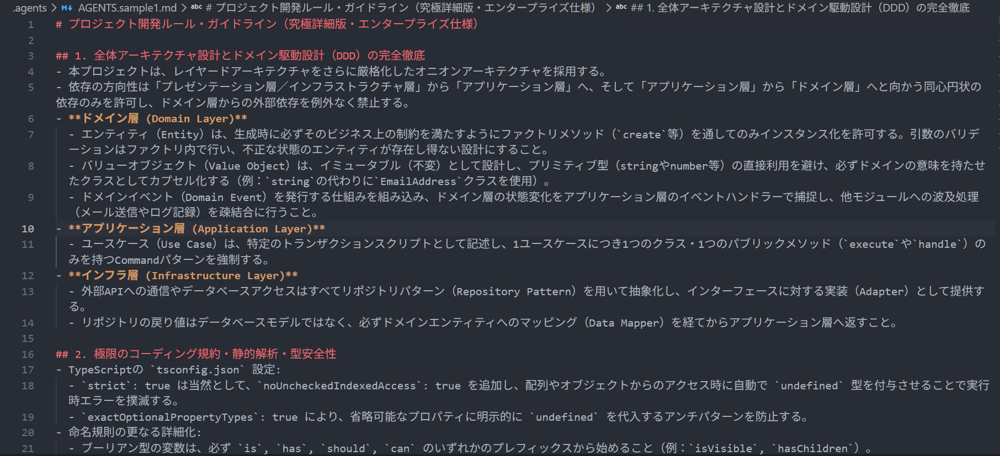
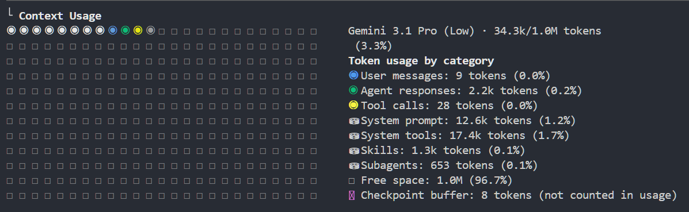
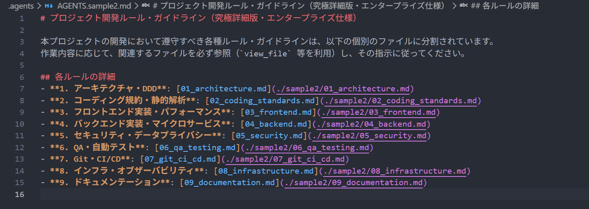
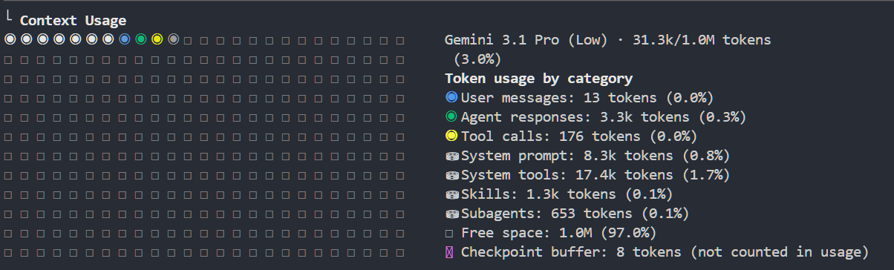

# 第2回. コンテキスト管理

エージェントに前提条件と枠組みを与える

---

## ワークショップ全体のロードマップ

<style scoped>
table { font-size: 22px; }
td, th { padding: 8px 12px; }
</style>

| # | テーマ | ひとことで言うと |
|---|---|---|
| 第1回 | AI Agent の全体像 | エージェントとは何かを掴む |
| **第2回** | **コンテキスト管理 + プロンプト設計** ← 今ここ | AI に何を・どう伝えるか |
| 第3回 | Skills | よく使う手順を再利用する |
| 第4回 | MCP | AI のできることを増やす |
| 第5回 | Subagents | 重い作業を別の頭脳に任せる |

---

## 本日のフロー

1. コンテキストとは何か (ウィンドウの構造とサイズ)
2. 不要ファイルの除外設定 (トークン削減)
3. 暗黙ルールの明文化: `AGENTS.md` (手戻り削減)
4. プロンプト設計の 4 原則
5. ハンズオン (Before/After 数値測定)
6. まとめ

---

## このセッションのゴール

- コンテキスト管理がもたらす効果を知る
- `AGENTS.md` を作成し、プロジェクトのルールを設定できる
- 不要ファイルの除外設定で機密情報の流出を防げる
- プロンプト改善で消費トークンを削減できる

---

# そもそも「コンテキスト」とは？

---

## コンテキスト = エージェントが見えている情報

- コンテキストとはエージェントが応答を生成する時に参照している入力全体
- コンテキストに収まる入力の上限がコンテキストウィンドウ
- エージェントは記憶力が良いのではなく、毎回ウィンドウの中身を読んで推測している

---

## コンテキストの中身と構造

<style scoped>
.cw-cap { text-align: center; font-size: 18px; font-weight: bold; color: #555; margin-bottom: 6px; white-space: nowrap; }
.main-container { display: flex; gap: 50px; align-items: center; justify-content: center; margin-top: 20px; }
.cw-box { width: 340px; border: 3px solid #333; border-radius: 6px; display: flex; flex-direction: column; overflow: hidden; }
.band { padding: 12px 14px; font-size: 17px; color: #fff; }
.b-sys  { background: #9aa0a6; flex: 0 0 auto; }
.b-hist { background: #fb8c00; flex: 1 1 auto; }
.b-proj { background: #4285f4; flex: 0 0 auto; }
.b-tool { background: #e53935; flex: 2 1 auto; }
.b-free { background: repeating-linear-gradient(45deg, #f8f9fa, #f8f9fa 10px, #e8eaed 10px, #e8eaed 20px); color: #777; flex: 1 1 auto; display: flex; align-items: center; justify-content: center; border-top: 2px dashed #999; }
table { font-size: 16px; border-collapse: collapse; }
td, th { padding: 6px 10px; border-bottom: 1px solid #ccc; }
</style>

<div class="main-container">

<div>
  <div class="cw-cap">▼ ウィンドウサイズ（上限）</div>
  <div class="cw-box" style="height: 340px;">
    <div class="band b-sys">システムプロンプト・ツール定義</div>
    <div class="band b-hist">ユーザー入力・AIの応答</div>
    <div class="band b-proj">Skills・Subagents 定義</div>
    <div class="band b-tool">ツール呼び出し</div>
    <div class="band b-free">空き</div>
  </div>
</div>

<table>
  <thead>
    <tr><th>中身</th><th>具体例</th><th>性質</th></tr>
  </thead>
  <tbody>
    <tr><td><span style="color:#9aa0a6">■</span> <b>システムプロンプト・ツール定義</b></td><td>指示・ツール定義（<code>AGENTS.md</code>含む）</td><td>固定</td></tr>
    <tr><td><span style="color:#fb8c00">■</span> <b>ユーザー入力・AIの応答</b></td><td>過去の指示と応答</td><td>増える</td></tr>
    <tr><td><span style="color:#4285f4">■</span> <b>Skills・Subagents 定義</b></td><td>呼び出し可能な定義の読み込み</td><td>使う分だけ</td></tr>
    <tr><td><span style="color:#e53935">■</span> <b>ツール呼び出し</b></td><td>読込ファイル・出力等</td><td>一番膨らむ</td></tr>
  </tbody>
</table>

</div>

---

## コンテキストウィンドウのサイズ

<style scoped>
table { font-size: 0.85em; }
.cw-flex { display: flex; gap: 30px; align-items: flex-start; margin-top: 10px; }
.cw-flex table { margin: 0; }
.cw-flex .note { flex: 1; font-size: 0.85em; }
</style>

主要モデルのコンテキストウィンドウ:

<div class="cw-flex">

<table>
  <thead><tr><th>ベースモデル</th><th>コンテキストウィンドウ</th></tr></thead>
  <tbody>
    <tr><td>Gemini 3.5 Flash</td><td>1M</td></tr>
    <tr><td>Gemini 3.1 Pro</td><td>1M</td></tr>
    <tr><td>Claude Sonnet 4.6</td><td>1M</td></tr>
    <tr><td>Claude Opus 4.6</td><td>1M</td></tr>
  </tbody>
</table>

<div class="note">

一見巨大に見えるが、**「読み込める量」と「精度を保てる量」は別物** — だからこそコンテキスト管理が要る。

</div>

</div>

---

## なぜコンテキスト管理が必要なのか

コンテキストが荒れたまま作業を進めると、次のような問題が起きる。

- **無駄なトークン消費**: 不要なログやキャッシュまで読み込み、余計なコストが発生する
- **手戻りの発生**: 前提や手順が伝わらず、エラーと修正を何度も繰り返す
- **規約を無視したコード**: プロジェクト固有のルールが共有されず、一般論での実装になる

コンテキストは無駄なコスト増加防ぎ、アウトプットの質を高めるための土台になる

---

## 対策①: 不要ファイルの除外設定

> `.env` や秘密鍵を誤って読み込ませない。トークンも節約する。

- **`.gitignore` による除外**
  - `agy` はデフォルトで `.gitignore` を尊重し、探索対象から除外する。
  - ログ、キャッシュ、巨大データ、`node_modules/` 等はここに記載する。
- **AI 専用の除外 (設定ファイルによる防御)**
  - Git管理下にあるが AI には読ませたくないファイルは、`agy` のグローバル設定 (`settings.json` の `permissions`) で拒否（deny）する。

---

## 対策②: `AGENTS.md` によるルールの設定

> プロジェクトのルールをファイルに集約する

- コンテキストの提供: プロジェクト概要・技術スタック・背景
- 明確で具体的な指示: 開発用コマンド、コーディング規約、AIの振る舞い
- 例の提示: 出力形式やコードの具体例
- 構造化: Markdown見出しや区切り文字でルールを整理して記述する

**配置場所**: 
- プロジェクト固有: `.agents/AGENTS.md`
- 共通: `~/.gemini/config/AGENTS.md`

---

## `AGENTS.md` 記述例 (1/2)

全てのルールを直接記述したパターン:

<style scoped>
pre { font-size: 18px; }
</style>

````markdown
# calc-cli
## コーディング規約
- テストは unittest を使用する（pytest 禁止）
- print ではなく logging でログを出力する
- 変数名はスネークケースに統一する
- 型ヒントを全関数の引数と戻り値に付与する
- 1関数1責務を徹底し、ネストは2階層までとする
...
## 出力フォーマット
- 修正提案は Before/After 形式で記述する
- diff は unified format で出力する
- コミットメッセージは Conventional Commits に従う
...
## 実装例
- 関数分割の Before/After コード例を掲載
- エラーハンドリングの実装例を掲載
- ログ出力の実装例を掲載
...
````

---

## `AGENTS.md` 記述例 (2/2)

詳細を外部ファイルへ切り出し、参照だけを残したパターン:

````markdown
# calc-cli
- コーディング規約: docs/coding-rules.md
- 出力フォーマット: docs/output-format.md
- 実装例: docs/implementation-examples.md
````

**ポイント**: 役割ごとに分けることで、関係するタスクの時だけ該当ファイルが読まれる。

---

## プロンプト設計のコツ

1. **具体的に指示する** — 対象ファイルや期待する挙動を曖昧にしない
2. **十分な文脈を与える** — 背景・制約・関連ファイルを伝える
3. **出力形式を指定する** — JSON形式、HTML形式など欲しい形を明示する
4. **例を示す** — 期待するコードスタイルや出力例を1つ見せる

---

## ハンズオン: コンテキスト管理の実践 (15分)

`demo/` にて、以下の2点を中心に実行・確認する。

1. **`/context` の使い方と見方**
   - 画面出力（または画像）を見ながら、コンテキスト使用量の各種カテゴリの意味を理解する。
2. **`AGENTS.md` 変更による `/context` の変化**
   - 実際に `AGENTS.md` を編集し、ファイル切り出し前後でのトークン数の変化を測定する。

---

## ① /context (1/2)

最初は、プロジェクトの様々なルールや規約が `AGENTS.md` に直接すべて記述されている状態を想定する。

| プロンプト（`AGENTS.md`） | コンテキスト（`/context`） |
| :---: | :---: |
|  |  |

---

## ① /context (2/2)

<style scoped>
ul { font-size: 20px; }
</style>

実際の `/context` では、先ほどの4分類がさらに細かく表示される。**プロジェクト指示（`AGENTS.md`）は「System prompt / tools」に含まれる**。

- User messages / Agent responses: ユーザーの入力とAIの返答
- Tool calls: ツールの実行ログや入出力
- System prompt / tools: システムプロンプト、ツール仕様、AGENTS.md等
- Skills: スキルの定義
- Subagents: サブエージェントの定義
- Free space: ウィンドウの空き領域
- Checkpoint buffer: 巻き戻し用の一時保存データ

---

## ② プロンプトの変更による/contextの変化

肥大化したコンテキストを削減するため、`AGENTS.md` に直接長文の規約を記述するのではなく、別ファイルへ切り出してリンクする設定に変更する。

| プロンプト（`AGENTS.md`） | コンテキスト（`/context`） |
| :---: | :---: |
|  |  |

---

## 変更前後でのコンテキスト消費量の比較

ファイル分割を行うことで、System prompt（ツールの仕様等を含む）の消費量が大幅に削減されたことが確認できる。

| 変更前 (`/context`) | 変更後 (`/context`) |
| :---: | :---: |
|  |  |

---

## まとめ

- **不要な記憶を削り、必要な知識を与える**
  - ファイル分割等を活用し、コンテキストの圧迫を防ぐことでパフォーマンス低下を回避する。
- **推測ではなく、`/context` で状態を可視化する**
  - トークンが何に消費されているか定期的に把握し、スリム化する習慣をつける。

次回: Skillsについて
