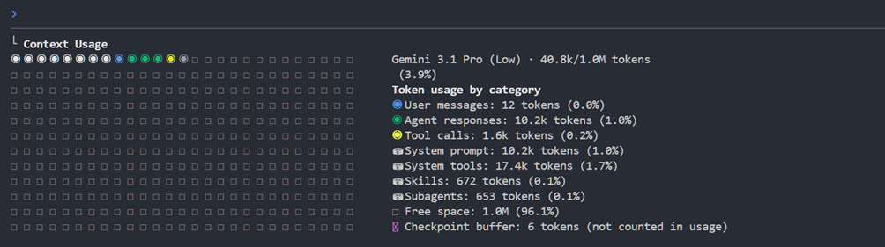
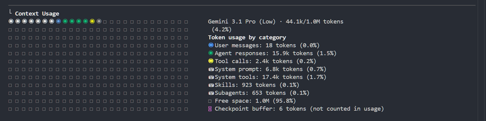

# 第3回. Skills 編
## 独自コンテキストを動的に注入するアーキテクチャ戦略

<!--
本日はAIエージェントを単なる便利なチャットボットから、自社のコード規約を熟知したシニアエンジニアへと引き上げるための技術的アプローチについて話す。
-->

---

## ワークショップ全体のロードマップ

<style scoped>
table { font-size: 22px; }
td, th { padding: 8px 12px; }
</style>

| # | テーマ | ひとことで言うと |
|---|---|---|
| 第1回 | AI Agent の全体像 | エージェントとは何かを掴む |
| 第2回 | コンテキスト管理 + プロンプト設計 | AI に何を・どう伝えるか |
| **第3回** | **Skills** ← 今ここ | よく使う手順を再利用する |
| 第4回 | MCP | AI のできることを増やす |
| 第5回 | Subagents | 重い作業を別の頭脳に任せる |

---

## 本日のフロー

1. このセッションのゴール
2. 素のエージェントの限界 / 巨大なルールブックの失敗
3. Skills によるアプローチ（構造・遅延読込・実装例）
4. 実践ユースケース（技術領域 / 開発プロセスの特化）
5. ハンズオン（独自 Skill の作成 + Agentic Workflow）
6. ベストプラクティス + まとめ

---

## このセッションのゴール

- スキルのアーキテクチャの仕組みを知る
- スキルによるコンテキストの変化を理解する
- 独自のスキルを作成できるようになる

<!--
LLMの魔法に頼るのではなく、エンジニアリングとしていかにAIの精度をコントロールするか、という泥臭い話をする。
-->

---

## 素のエージェントの限界

**要件: ログイン機能の実装**
動作はするが、プロダクション水準に満たないコードが出力される課題

- セキュリティの甘さ: パスワードの平文保存や、トークンを脆弱な領域に保存してしまう
- 異常系の軽視: エラーハンドリングがログ出力のみで、異常系の考慮が抜けている
- 規約の崩壊: チームのコーディング規約やデザインルールに則ってない書き方をしてしまう

プロンプトで毎回これらのルールに従えと書くのは非現実的

<!--
毎回ゼロから指示を出すのは面倒だな。では、プロジェクトの全ルールを最初からAIに読み込ませておけば解決するのだろうか。実はそこに大きな罠がある。
-->

---

## 巨大なルールブックの失敗

あらゆるルールをAGENTS.mdのような単一ファイルに全て詰め込むと...

- コンテキストウィンドウの逼迫
  - ルールを読むだけで上限に達し、肝心のコードを読めなくなる
- Lost in the Middle
  - 文章が長すぎると、中間にある重要なルールが抜け落ちやすくなる
- コンテキストの汚染
  - UIを作っている時にバックエンドのルールが混ざるなど、ノイズによるハルシネーションが起きる

<!--
すべてをAGENTS.mdに書いて万能なAIを作ろうとするのは、実はAIの能力を下げるアンチパターンだ。容量の無駄遣いになるだけでなく、情報のノイズによって精度が著しく低下する。
-->

---

## Skills（スキル）によるアプローチ (1/2)

- プロンプトの羅列ではなく、**専門領域のルールや知識**を独立したモジュールとして管理するアーキテクチャ
- 必要な状況に合致したモジュールのみを、コンテキストへ動的に注入する（遅延読み込み）

<!--
そこで登場するのがSkillsだ。単なる指示書の集まりではなく、必要な知識モジュールだけを必要なタイミングでLLMのコンテキストに動的注入する仕組みである。
-->

---

## Skills（スキル）によるアプローチ (2/2)

**コンテキストの最適化（Dynamic Context Injection）による効果**
タスクに特化した知識モジュールのみを動的注入することで、以下の効果をもたらす。

- コンテキストの節約: 上限逼迫を防ぎ、ソースコード等の解析に必要な余力を確保
- ノイズの排除: 不要な領域のルールを遮断し、ハルシネーションを防止
- 精度の向上: AIの注意力を特定ドメインに集中させ、実務に耐えうるコードを出力

<!--
これにより、コンテキストの枯渇やハルシネーションをアーキテクチャレベルで根本から解決する。
-->

---

## Skillsの構造

単一のテキストファイルではなく、スクリプトや参照データを束ねたパッケージとして構成される。

```text
.agents/skills/my-skill/
 ├── SKILL.md     ➔ [必須] コアとなる指示書（トリガー条件 ＋ 最小限のコア・ルール）
 ├── scripts/     ➔ [任意] Linter実行などの自作ヘルパースクリプト群
 ├── examples/    ➔ [任意] 実装例や使用パターンのサンプルコード
 └── references/  ➔ [任意] 巨大なAPI仕様書などの静的リソース
```

<!--
Skillの強みは、単なるテキストではなく「物理的なディレクトリ構造」を持っている点だ。
実行可能なスクリプトや、必要に応じて読み込まれる巨大なリファレンスをパッケージ化することで、エンジニアリングとしてのAI拡張が可能になる。
-->

---

## 各ディレクトリの役割 (1/2)

**1. `SKILL.md`（コア指示書）【必須】**
- 役割: スキルの起点。トリガー条件（YAML）と基本ルール（Markdown）を定義。
- 設計: コアな指示のみに留め、AIの注意力を特定のタスクに集中させる。

**2. `scripts/`（動的拡張）【任意】**
- 役割: AI自身が実行可能なヘルパースクリプト群（Lint実行、テスト起動など）。
- 設計: 標準の実行ツールで不足するプロジェクト固有の操作をAIに付与する。

<!--
SKILL.mdがシステムプロンプトのコアだとすれば、scriptsは実行可能なツール群の役割を持つ。
-->

---

## 各ディレクトリの役割 (2/2)

**3. `examples/` & `references/`（静的拡張）【任意】**
- 役割: 実装サンプル（examples）、巨大なAPI仕様書（references）。
- 設計: 常時読み込ませず、AIが必要なときにツールでオンデマンド参照する。

<!--
examplesやreferencesは必要に応じてロードされる外部データソースの役割を持つ。
これらを意図的に分離することで、コンテキストの無駄を省きながら無限に能力を拡張できる。
-->

---

## SKILL.md と遅延読み込み（Lazy Loading）

```yaml
---
name: review
description: レビューを求められた際に呼び出すこと
---
```
```markdown
# ルール
- N+1問題などのパフォーマンス低下を防ぐ
- 正常系だけでなく異常系を網羅する
```

**遅延読込**: `依頼` ➔ `description判定` ➔ `ルール読込`
ノイズを排除し、特定領域に特化することで精度を最大化する。

<!--
descriptionがトリガーだ。必要なルールだけを遅延ロードする。
-->

---

## 拡張ディレクトリの実装例（動的拡張）

**`scripts/get-db-schema.sh`（動的拡張の例）**
```bash
#!/bin/bash
# AIがSQLやORMのコードを生成する際、古いマイグレーションファイルを見て
# 存在しないカラムを幻覚（ハルシネーション）するのを防ぐためのスクリプト。
# 実際のDBから最新のスキーマ（DDL）を動的に抽出してコンテキストに渡す。
echo "現在のデータベースの最新スキーマ定義は以下の通りです:"
sqlite3 ./dev.db ".schema" | grep -v "sqlite_sequence"
```

<!--
こちらは動的拡張の実例だ。例えばAIに「新機能のAPIを作って」と頼む際、事前にこのスクリプトを自律的に実行させることで、マイグレーション履歴から推測するのではなく「現在の正確なテーブル構造」を把握させ、存在しないカラム名を幻覚するのを防ぐ。
-->

---

## 拡張ディレクトリの実装例（静的拡張）

**`references/BACKEND_GUIDELINES.md`（静的拡張の例）**
```markdown
## バックエンド実装ガイドライン

## 1. セキュリティ（最優先事項）
- `SELECT *` の使用禁止（個人情報の意図しない露出を防止）
- パスワードやトークン等の機密情報はログに出力しないこと

## 2. パフォーマンスと可用性
- N+1問題の防止: ORMで関連データを引く際は Eager Loading を強制
- リソース保護: 一覧取得APIには必ずページネーションを実装すること
```

<!--
こちらは静的拡張の実例だ。巨大なAPI仕様書や社内ガイドラインもコンテキストを圧迫することなく、必要なときにオンデマンドでreferencesから読み込んでくれる。
-->

---

## 実践ユースケース①: 技術領域の特化
プロジェクトの「どの部分を作るか」を分担させる。

- `frontend` / `backend`
  - UIコンポーネントの分割ルールや、APIレスポンスの統一フォーマットの強制
- `architecture`
  - 個別の機能実装ではなく、ディレクトリ構成や技術スタックの選定など全体設計に特化
- `infra`
  - DockerやCI/CDパイプラインなど、インフラ環境の構築ルールに特化

<!--
プロジェクト固有の**譲れないルール**を厳守させる。これらを同時に読ませないからこそ、各領域で極めて高い精度のコードが出力される。
-->

---

## 実践ユースケース②: 開発プロセスの特化
「コードを書く」以外のエンジニアリング工程を分担させる。

- `conductor`
  - タスク分解と他のAIへの指示出しを行うマネージャー役
- `reviewer`
  - 社内規約の準拠チェックやパフォーマンス問題の監査に特化
- `tester`
  - エッジケースを網羅した品質保証テストの生成に特化
- `document-writer`
  - ソースコードからAPIリファレンスを自動生成

<!--
コードを書くビルダーとしてだけでなく、レビュアーやQAエンジニアとしてのペルソナも作れる。
-->

---

## ハンズオン (1/2)

**【Step 1】アーキテクチャの統一化（手動）**
- 依頼: 商品レビュー機能を作って
- **`architect`**: きれいに分離された4層レイヤードアーキテクチャ

**【Step 2】自律的なコードレビュー（手動）**
- 要件: 生成コードのレビュー
- **`reviewer`**: Linter実行と社内規約に基づく自己レビュー

<!--
ここで実際の画面デモを行う。
Step1とStep2を人間が順番に指示するパターンを見せる。
-->

---

## ハンズオン (2/2)

**【Step 3】Agentic Workflow（スキルの統合）**
- 要件: 設計から実装・レビュー・修正までの自動化
- **`tech-lead`**: `architect`と`reviewer`のスキルを組み合わせ、自律的に連携させて一気通貫のフローを実行する。

<!--
究極の「Agentic Workflow」として、AI自身がペルソナを切り替えながら自己完結するフローを見せる。生成AIに「指示」する時代から、自律的な「労働」を任せる時代へのパラダイムシフトを体感してくれ。
-->

---

## コンテキスト使用量の比較

巨大な `AGENTS.md` と、Skillによる遅延読込のコンテキスト（システムプロンプト）の比較である。

- **❌ 巨大なAGENTS.md**: System prompt `10.2k` tokens
- **🟢 Skillの遅延読込**: System prompt `6.8k` tokens

<div style="display: flex; justify-content: space-between;">
  
  
</div>

<!--
デモ環境での実際のトークン消費の比較だ。左が旧来の巨大なAGENTS.md、右がSkillによる遅延ロードである。
約30%以上の無駄なコンテキスト削減に成功しており、プロジェクトが巨大になるほどこの差は顕著になる。
-->

---

## スキル作成のベストプラクティスとアンチパターン
<style scoped>
li, p { font-size: 0.9em; }
</style>

**ベストプラクティス**
- 責務の単一化: 特定の役割（`architect` や `reviewer` 等）ごとにSkillを切り出す
- 静的拡張（参照の分離）: `SKILL.md` の記述は最小限にし、詳細仕様は `references/` に退避する
- 動的拡張（実測の重視）: データベース状態などは推測させず、`scripts/` に専用ツールを持たせる

**アンチパターン**
- 巨大な神ルールの作成: 1つの `AGENTS.md` や `SKILL.md` にすべてのルールを詰め込む
- 不明瞭なトリガー: いつ呼び出せばよいか分からない曖昧な `description` を設定する

<!--
（ここで失敗談を交える）
私も最初は全てのルールを1つに書いていたが、コンテキストがあふれてAIが指示を忘れてしまった。
役割ごとにSkillを細分化し、必要な情報を必要な時にだけ「遅延ロード」させるのが、AIの精度を最大化する最大のコツだ。
-->

---

## チーム開発へのスケール（属人化の排除）

**プロンプトから「コードとしての知識（Knowledge as Code）」へ**

- **`.agents/` ディレクトリのGit管理（属人化からの脱却）**
  - プロジェクト直下のスキル定義をコミットし、コードと共にバージョン管理する
  - 属人的な運用を終わらせ、ドメイン知識をチームの共有資産とする
- **AIの「振る舞い」をチーム全体で共有**
  - シニアエンジニアの暗黙知（レビュー観点など）をSkill化することで、ジュニアエンジニアでも同等の品質を引き出せる

<!--
一人が苦労して作ったプロンプトをWikiに貼る時代は終わった。SkillをコードとしてGit管理することで、チーム全体の生産性が底上げされる。
-->

---

## まとめ
<style scoped>
li, p { font-size: 0.9em; }
</style>

- 汎用プロンプトから、制約事項の「動的注入」へ
  - 巨大なルールブックを廃止し、必要な知識だけを遅延ロード（Lazy Loading）する
- 属人的なハックから、「Knowledge as Code」へ
  - AIへの指示をGit管理し、シニアの暗黙知をチーム全体の共有資産にする
- 単一のチャットボットから、「Agentic Workflow」へ
  - 役割を細分化（`architect`, `reviewer` 等）し、AI自身が自律的に連携するフローを構築する

**生成AIを「ツール」として使う時代から、「チームの一員」として自律的に働かせる時代へ。**

---

## Q&A
