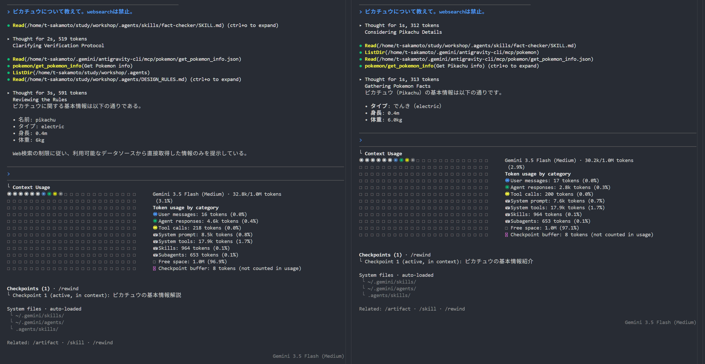

# S4. MCP 編
## エージェントに新しいツールを持たせる

Model Context Protocol (MCP) の基本とカスタムサーバーの自作

---

## 本日のフロー (60 分)

| 時間 | パート | 内容 |
|---|---|---|
| 0-15 | 概念とエコシステム | MCPの基本、導入メリット、主要なMCP一覧 |
| 15-25 | 導入デモ | Playwright MCP を使った社内システム操作デモ |
| 25-50 | ハンズオン | **MCPサーバーの統合とコード拡張（ハイブリッド形式）** |
| 50-60 | セキュリティとまとめ | パス制限、プロセスの権限管理 |

---

## このセッションのゴール

本セッション終了時に、以下の状態になることを目指す。

1. **MCPの役割と技術的意義を理解する**
   エージェントと外部システムを繋ぐ標準プロトコルとしての役割を把握する。
2. **MCPのコンテキストへの影響を理解する**
   データ取得時のLLMのトークン制約やリスクを認識し、適切な設計方針を持つ。
3. **公開されているMCPエコシステムを利用できる**
   既存の強力なサーバーを自環境に導入し、設定・活用できるようになる。
4. **独自のMCPサーバーを自分で作成できる**
   JavaScript（Node.js）を用いて、自社特有のシステムをAI対応化できるようになる。

---

## MCP とは何か

**Model Context Protocol (MCP)** は、AIエージェントに「ツール」を提供するための標準プロトコルである。

- Anthropic が提唱したオープンスタンダード。
- クライアント（エージェント）とサーバー（ツール）間を双方向で繋ぐ。
- **Tools**（アクション）、**Resources**（データ）、**Prompts**（テンプレート）の3つを提供する。

---

## MCP 誕生の歴史的背景

**【Before】ツール連携の独自統合と N 対 M 問題**
MCPの登場以前は、外部サービスと連携するには独自の統合コードを書く必要があった。そのため、**アプリM個 × 連携先サービスN個** を個別に管理する必要があった。

**【After】Anthropic による標準化の提唱**
2024年に Anthropic が MCP をオープンソースとして公開した。クライアントとツールの通信仕様を標準化し、「AI版 USB Type-C」「AI版 LSP」のような役割を果たした。

これにより、一度作成した MCP サーバーはあらゆるクライアント環境でそのまま動作するようになり、 **アプリM個 + 連携先サービスN個** の管理になった。

---

## なぜ MCP が必要なのか

LLM 単体では、学習時点の知識しか持たず、社内システムや最新データに直接アクセスできない。

- **自動化のシームレス化**
  人間が手動でデータを探してコピペする手間がなくなり、エージェントが自律的に社内システムへアクセス可能になる。
- **拡張性の高さ (Plug & Play)**
  一度 MCP サーバーを書けば、プロトコルに対応するすべてのクライアント（Antigravity、Claude Code 等）から利用可能になる。

---

## コンテキストウィンドウへの影響と対策

MCP ツールが返すデータ（DBのレコードや長大なAPIレスポンス）は、**すべてLLMのコンテキスト（トークン）を消費**する。

**課題とリスク**
無闇に使うと、コンテキスト上限に達して精度が落ちたり、利用上限に達したりとコストが高騰する。

**対策のベストプラクティス**
- サーバー側で「検索」「絞り込み」「ページネーション」を実装する。
- エージェントに対するプロンプトで「少しずつ取得して」「必要な部分だけ要約して」と指示を出す。

---

### 寄り道：有効化するサーバー数はコンテキストを圧迫するか（検証）

ここまでは「ツール呼び出しの戻り値」の話である。では、MCPサーバーを多数**有効化**しておくこと自体はコンテキストを圧迫するのか、実機で比較した。

- 18サーバーを設定した状態と、1サーバーのみを設定した状態で同じ質問を投げる
- `/mcp` で確認すると、どちらの状態でも設定した全ツールが認識されている（接続自体は成立している）

---

### 検証：左が18サーバー設定、右が1サーバーのみ



---

### 検証結果と留意点

| | 18サーバー設定 | 1サーバーのみ |
|---|---|---|
| System tools | 17.9k tokens | 17.9k tokens |
| 合計 | 32.8k tokens | 30.2k tokens |

「System tools」の消費量は、有効化したサーバー数によらず同一という結果になった。ツールを有効化することと、その定義を常時コンテキストへ全展開することは、必ずしもイコールではない可能性がある。

ただし内部実装は非公開であり、今回の一回の検証のみから断定的な結論は出せない。「有効化数=即コンテキスト圧迫」と単純に捉えず、気になった際は自分の環境で実測してみる習慣が重要である。

---

## 主要な MCP エコシステム一覧

目的に合わせて、様々な公式・コミュニティサーバーが存在する

**ローカル・社内ネットワーク完結（セキュア環境向け）**
- **Filesystem**: ログファイルやドキュメントの読み書き
- **SQLite / Postgres**: 社内DBへ接続し、自然言語でデータ抽出
- **Playwright**: APIのない社内Webシステムの自動操作
- **Command / Docker**: コマンド実行やコンテナ操作

**クラウド・SaaS連携**
- **GitHub / GitLab**: Issue要約、PRの自動作成
- **Slack**: チャット要約、タスク完了通知

---

## 導入デモ：Playwright MCP (10 分)

APIが用意されていないローカルアプリや社内システムであっても、MCPを経由してブラウザ操作をAIエージェントに委譲できる。

### デモ内容
作成済みのローカルアプリに対して、エージェントに「アプリの画面を操作し、結果のスクリーンショットを撮影して報告して」と指示を出す。

### 注目ポイント
エージェントがスクリーンショットを通じて画面の状態を視覚的に認識し、自律的にクリックやテキスト入力などの操作手順を推論して実行する点を確認する。

---

## ハンズオン：ポケモン図鑑 MCP サーバーの拡張 (25 分)

完成済みのシンプルなMCPサーバーをエージェントに統合して動作を確認したのち、実際にコードを書き換えて機能を拡張する。
APIキー不要のパブリックAPI（PokéAPI）をラップしたサーバーを通じて、MCPの仕組みを実践的に理解する。

### ステップ 1: クローンと動作確認 (10 分)

用意されたリポジトリを利用し、エージェントへの統合を体験する。

1. AIエージェント（agy等）にMCP設定を追加し、サーバーを登録する。
2. エージェントに「ピカチュウのタイプと体重を教えて」と質問し、API経由で情報を取得して回答することを確認する。

---

### 寄り道：コンテキスト消費量を実測する（任意）

時間があれば、`index.js` に一時的に `console.error(JSON.stringify(data).length)` を仕込み、PokéAPIの生レスポンスの文字数を確認してみる。

サーバーが返す整形済みテキスト（数十文字）との差を実感できると、「なぜ絞り込みが必要か」への理解が深まる。

---

### ステップ 2: コード構造の理解 (5 分)

`index.js`の主要な実装は、2つのハンドラー登録からなる。

- **`ListToolsRequestSchema`**: エージェントが「どんなツールが使えるか？」を把握するための型定義（JSON Schema）。
- **`CallToolRequestSchema`**: 実際にツールが呼ばれた際の具体的な処理（APIリクエストとデータ抽出）。

---

### 詳細: サーバーの初期化

サーバーの本体を生成し、機能を宣言する。

```javascript
const server = new Server(
  { name: "pokemon-server", version: "1.0.0" },
  { capabilities: { tools: {} } }
);
```
- **第一引数**: サーバー名とバージョン。識別子として使われる。
- **第二引数**: 有効化する機能（Capabilities）の宣言。今回は `tools`（ツール提供機能）のみを有効にしている。

---

### 詳細: ツールの定義

<!-- visual overflow チェック(Playwright)で実際のはみ出しなしを確認済み。静的解析の行数目安はコードブロックの余白を過大評価するため対象外とする -->
<!-- ignore-layout -->

```javascript
server.setRequestHandler(ListToolsRequestSchema, async () => ({
  tools: [{
    name: "get_pokemon_info",
    description: "ポケモンの基本情報を取得します。",
    inputSchema: {
      type: "object",
      properties: { pokemon_name: { type: "string", description: "英語名" } },
      required: ["pokemon_name"],
    },
  }],
}));
```

- **`description`**: LLMがツールを選ぶ判断基準となる。
- **`properties`**: 引数の型と説明。LLMが値を推論する助けになる。
- **値の決定者**: 実引数はAIエージェント(LLM)が文脈から推論する。

---

### 詳細: 処理の実装

```javascript
server.setRequestHandler(CallToolRequestSchema, async (request) => {
  if (request.params.name === "get_pokemon_info") {
    const { pokemon_name } = request.params.arguments;
    const res = await fetch(`https://pokeapi.co/api/v2/pokemon/${pokemon_name}`);
    const data = await res.json();
    const text = `名前: ${data.name}\n身長: ${data.height/10}m\n体重: ${data.weight/10}kg`;
    return { content: [{ type: "text", text }] };
  }
});
```

- **分岐と引数**: `request.params.name` で分岐し、`arguments` から値を取得する。
- **戻り値**: `content` 配列に文字列を入れて返す。これがLLMのコンテキストになる。

---

### ステップ 3: 機能拡張に挑戦 (10 分)

現在のサーバーは「名前」「タイプ」「身長」「体重」しか返さない。
エージェントが**「ポケモンの特性（abilities）」**も答えられるように、コードを拡張してみよう。

**ヒント**:
PokeAPIのレスポンスには `data.abilities` という配列が含まれている。これを `.map()` 等で展開し、返す文字列（`text`変数）に追加する。修正後はサーバープロセスを再起動して動作を確認する。

---

## Before/After：生データ vs 絞り込み設計

今動かしたポケモン図鑑 MCP サーバーの実測値で比較する。

| 設計 | 返す内容 | データ量 | 概算トークン数 |
|---|---|---|---|
| **Before**（生データをそのまま返す） | 技・ゲームバージョン別データ等を含む全JSON | 約 288,000 文字 | **約 72,000 トークン** |
| **After**（本ハンズオンの実装） | 名前・身長・体重のみに絞り込んだテキスト | 30 文字 | **約 8 トークン** |

**差はおよそ 9,000 倍。** 1回のツール呼び出しだけでコンテキスト予算の大部分（数十万トークン級モデルでも数割）を溶かし得ることが分かる。

---

## なぜここまで差が出るのか

生データには、エージェントの質問（タイプと体重）に対して**不要な情報が大量に含まれる**。

- ゲームバージョンごとの技の習得レベル一覧（`moves`：100件超）
- 過去シリーズとの互換性データ、ゲーム内の各種フラグ
- 画像URLや効果音ファイル名などのメタデータ

→ サーバー側で**質問に答えるために本当に必要な項目だけ**を抽出・整形して返すことが、コンテキスト管理の実務そのものである。

---

## MCPがもたらすセキュリティの危険性

MCPはAIに強力な操作権限を与えるため、適切に管理しないと以下のリスクが生じる。

- **プロンプトインジェクション**: 外部入力によってAIが騙され、意図しないツール操作を実行させられる（Tool Poisoning）
- **マルウェア感染**: 悪意のあるサードパーティ製サーバーを通じたシステム被害（サプライチェーン攻撃）
- **ファイルへの過剰アクセス**: ディレクトリ制限の不備による、システムファイルや機密情報への不正アクセス
- **認証情報の漏洩**: 設定ファイル等へのハードコードによるAPIキーなどの流出

---

## セキュリティ対策

MCPを安全に運用するための主要な対策

- 使用するMCPのみを有効化し、攻撃対象領域を最小化する（**最小特権の原則**）
- **Roots機能**を活用し、アクセス可能なディレクトリ・リソースを厳密に制限する
- MCPサーバーを専用コンテナなどの独立したサンドボックス環境で実行する
- AIとツールの入出力を検証・無害化し、不正操作を防ぐ
- 出所不明なサードパーティ製サーバーの利用を避ける（サプライチェーン対策）
- 認証情報をハードコードせず、シークレット管理システムから実行時に注入する

---

## まとめ

- **MCP はエージェントの拡張インターフェース**
  社内システムやツールを容易に接続し、自律的な操作を可能にする。
- **コンテキスト管理が実運用の鍵**
  必要なデータだけを絞り込んで取得する設計が不可欠である。
- **自作のハードルは極めて低い**
  Node.js SDK 等を活用すれば、既存の社内資産を簡単に AI 対応化できる。
