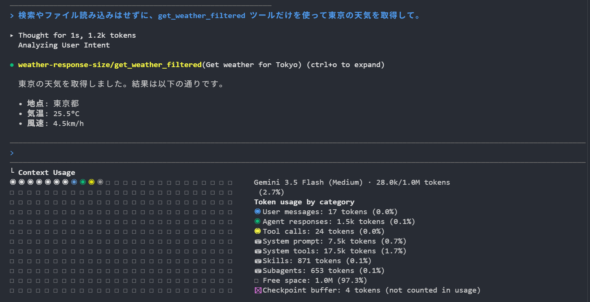
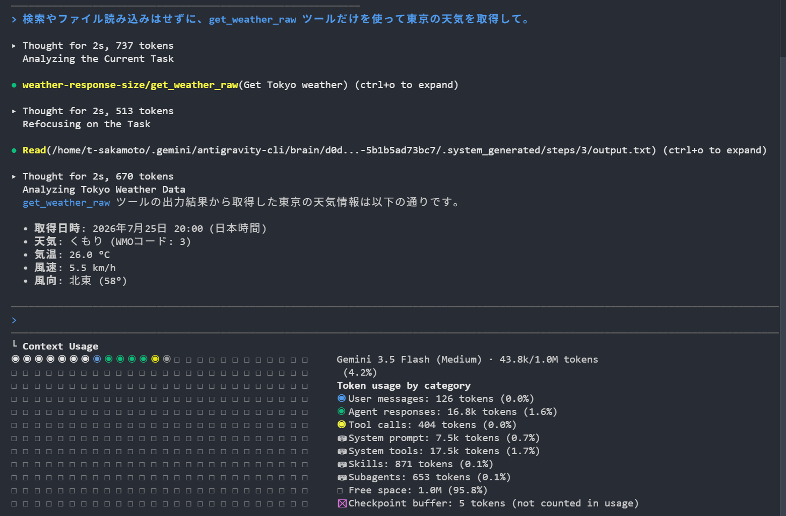

# 第4回. MCP 編
## エージェントに新しいツールを持たせる

Model Context Protocol (MCP) の基本とカスタムサーバーの自作

---

## ワークショップ全体のロードマップ

<style scoped>
table { font-size: 22px; }
td, th { padding: 8px 12px; }
</style>

| # | テーマ | 概要 |
|---|---|---|
| 第1回 | AI Agent の全体像 | エージェントとは何かを掴む |
| 第2回 | コンテキスト管理 + プロンプト設計 | AI に何を・どう伝えるか |
| 第3回 | Skills | よく使う手順を再利用する |
| **第4回** | **MCP** | AI のできることを増やす |
| 第5回 | Subagents | 重い作業を別の頭脳に任せる |

---

## 本日のフロー

1. 概念とエコシステム: MCPの基本、3つの機能、コンテキストへの影響、主要なMCP一覧
2. Playwright MCP を使ったAIによる画面操作
3. ハンズオン: MCPサーバーの統合とコード拡張（ハイブリッド形式）
4. セキュリティとまとめ: パス制限、プロセスの権限管理

---

## このセッションのゴール

- MCPの役割と技術的意義を理解する（エージェントと外部システムを繋ぐ標準プロトコル）
- コンテキストへの影響を理解する（LLMのトークン制約やリスクを踏まえた適切な設計）
- 公開されているMCPを利用できるようになる（既存サーバーを導入・設定）
- 独自のMCPサーバーが作成できるようになる（JavaScriptを用いた自社特有システムのAI対応化）

---

## MCP とは何か

**Model Context Protocol (MCP)** は、AIエージェントにツール（機能）を提供するための標準プロトコルである。

- Anthropic が提唱したオープンスタンダード。LLM単体では学習時点の知識しか持たず社内システムや最新データに直接アクセスできない、という課題を解決する。
- クライアント（エージェント）とサーバー（ツール）間を双方向で繋ぐ。一度書けば、対応する全クライアント（Antigravity、Claude Code、Codex 等）から利用可能（Plug & Play）。
- **Tools**、**Resources**、**Prompts**の3つを提供する。

---

## MCP の3つの基本機能（主導権の違い）

<style scoped>
table { font-size: 20px; }
td, th { padding: 5px 8px; }
p, li { font-size: 21px; }
</style>

MCP サーバーは **Tools**・**Resources**・**Prompts** の3つを提供する。同じ「サーバー機能」でも、誰が呼び出すか（主導権）によって性質が異なる。

| 機能 | 主導権（Control） | 説明（Description） | 例（Example） |
|---|---|---|---|
| **Tools** | Model-controlled | LLMがアクションを実行するための関数 | APIへのPOSTリクエスト、ファイル書き込み |
| **Resources** | Application-controlled | クライアントが取得・管理する文脈データ | ファイルの内容、gitの履歴 |
| **Prompts** | User-controlled | ユーザーの選択によって呼び出される対話的なテンプレート | スラッシュコマンド、メニュー選択 |

出典: [MCP Specification 2025-11-25, Server Overview](https://modelcontextprotocol.io/specification/2025-11-25/server/index#overview)

---

## Tools（アクションの実行）

人手を介さず、AIに実行・操作そのものを任せたい場面で使う（例: ファイル編集やAPI呼び出し）。

- **仕組み**: サーバー側でツールの入力スキーマ（JSON Schema）と処理内容を定義する
  - LLMが文脈から必要なツールを選択し、引数を推論してサーバーに実行を要求する
- **用途例**: ファイルの作成・編集／データベースへのレコード追加／ブラウザでのボタンクリックやフォーム送信

---

## Resources（データの読み込み）

前提データを確実に渡したい場面で使う（例: 本番DBのスキーマ）。

- **仕組み**: `file://` や `db://` 等のURIで表現する
  - UI上の一覧・ツリーからユーザーに明示的に選ばせる実装
  - アプリが自動でコンテキストに組み込む実装
- **用途例**: ログファイルの読み込み／DBのテーブル定義取得／APIから最新データを取得

---

## Prompts（テンプレートの活用）

複雑な定型指示を毎回手打ちせず、同じ品質でワンコマンド実行できる。

- **仕組み**: 変数を埋め込めるテンプレートとしてサーバーに登録する
  - スラッシュコマンドやメニュー選択など、ユーザーが選んで実行することを前提とする
- **用途例**: コードレビューの定型指示を実行／ボイラープレート生成を指示／バグ解析を指示

---

## コンテキストウィンドウへの影響と対策

MCP ツールが返すデータ（DBのレコードや長大なAPIレスポンス）は、**すべてLLMのコンテキスト（トークン）を消費**する。

**課題とリスク**
無闇に使うと、コンテキスト上限に達して精度が落ちたり、利用上限に達したりとコストが高騰する。

**対策のベストプラクティス**
- サーバー側で検索、絞り込み、ページネーションなどを実装する。
- エージェントに対するプロンプトで、少しずつ取得するよう指示する、あるいは必要な部分だけ要約させる。

---

## 主要な MCP エコシステム一覧

<style scoped>
li {
  font-size: 20px;
  margin-bottom: 4px;
}
p, ul {
  margin-top: 5px;
  margin-bottom: 5px;
}
strong {
  font-size: 20px;
}
</style>

目的に合わせて、多様な外部サービスやツールと接続可能である

- **GitHub / GitLab / Backlog**: Issueやタスク・課題の要約、プルリクエストの自動作成
- **Figma**: デザインファイルの読み込みやコンポーネント情報の取得
- **Notion / Obsidian**: ナレッジベースの検索、ページやメモの作成、データベース操作
- **Slack / Discord**: チャットの読み書き、チャンネル情報の要約
- **Google系 (Gmail / Calendar / Maps)**: メール送信、予定調整、位置検索
- **Playwright**: APIのないWebシステムのブラウザ自動操作
- **SQLite / Postgres**: データベースへの接続と自然言語によるデータ抽出

---

## 導入デモ: Playwright MCP

<style scoped>
li {
  font-size: 20px;
  margin-bottom: 3px;
}
p, ol, ul {
  font-size: 20px;
  margin-top: 4px;
  margin-bottom: 4px;
}
</style>

API未対応のシステムであっても、MCP経由でブラウザ操作をエージェントに委譲できる。

**注目ポイント**
- スクリーンショットによる画面状態の視覚的認識
- 自律的な操作手順（クリックやテキスト入力等）の推論と実行

**実行手順**
1. **アプリ起動**: 
    ```
    cd s4/demo/demo1-playwright-app
    npx -y http-server -p 3000
    ```
2. **MCP設定**: エージェントの設定に `playwright` サーバーを登録して起動
   `"playwright": { "command": "npx", "args": ["-y", "@playwright/mcp"] }`
3. **エージェント指示**: 以下をチャットUIで指示する（または `./run.sh` で自動実行）
   `demo アプリ（http://localhost:3000）でヘルスチェックを実行し、結果画面のスクリーンショットを撮影して報告して`

---

## ハンズオン: 天気予報 MCP サーバーの拡張

シンプルなMCPサーバーをエージェントに統合し、実際にコードを書き換えて機能を拡張する。
APIキー不要のパブリックAPI（Open-Meteo）をラップしたサーバーを通じて、MCPの仕組みを実践的に理解する。

---

## ステップ 1: セットアップと動作確認

<style scoped>
p, li {
  font-size: 21px;
}
pre {
  margin-top: 4px;
  margin-bottom: 4px;
}
</style>

1. ディレクトリ移動とパッケージインストール:
    ```
    cd s4/demo/demo2-weather-server/weather-mcp-server
    npm install
    ```
2. エージェントへの統合:
   ローカル設定（`s4/demo/demo2-weather-server/.agents/mcp_config.json`）の `/absolute/path/to/...` 部分を絶対パスに書き換える
   ```json
   "weather": {
     "command": "node",
     "args": ["/absolute/path/to/s4/demo/demo2-weather-server/weather-mcp-server/index.js"]
   }
   ```
3. 動作確認:
   エージェントに **東京の天気を教えて** と質問する（または `./run_step1.sh` で自動実行）

---

## ステップ 2: コード構造の理解

`index.js`の主要な実装は、2つのハンドラー登録からなる。

- **`ListToolsRequestSchema`**: エージェントが利用可能なツール一覧を把握するための型定義（JSON Schema）。
- **`CallToolRequestSchema`**: 実際にツールが呼ばれた際の具体的な処理（APIリクエストとデータ抽出）。

---

## 詳細: サーバーの初期化

サーバーの本体を生成し、機能を宣言する。

```javascript
const server = new Server(
  { name: "weather-server", version: "1.0.0" },
  { capabilities: { tools: {} } }
);
```
- **第一引数**: サーバー名とバージョン。識別子として使われる。
- **第二引数**: 有効化する機能（Capabilities）の宣言。今回は `tools`（ツール提供機能）のみを有効にしている。

---

## 詳細: ツールの定義

<style scoped>
p, li { font-size: 19px; margin-top: 3px; margin-bottom: 3px; }
</style>

<!-- visual overflow チェック(Playwright)で実際のはみ出しなしを確認済み。静的解析の行数目安はコードブロックの余白を過大評価するため対象外とする -->
<!-- ignore-layout -->

```javascript
server.setRequestHandler(ListToolsRequestSchema, async () => ({
  tools: [{
    name: "get_weather",
    description: "指定した地点の現在の天気を取得します。",
    inputSchema: {
      type: "object",
      properties: { location: { type: "string", description: "地名（英語表記）" } },
      required: ["location"],
    },
  }],
}));
```

- `description`: LLMがツールを選ぶ判断基準となる。
- `properties`: 引数の型と説明。LLMが値を推論する助けになる。
- **実引数の決定**: 呼び出し時の引数はAIエージェント（LLM）がコンテキストから推論して決定する。

---

## 詳細: 処理の実装

<style scoped>
p, li { font-size: 19px; margin-top: 3px; margin-bottom: 3px; }
</style>

<!-- visual overflow チェック(Playwright)で実際のはみ出しなしを確認済み。静的解析の行数目安はコードブロックの余白を過大評価するため対象外とする -->
<!-- ignore-layout -->

```javascript
server.setRequestHandler(CallToolRequestSchema, async (request) => {
  if (request.params.name === "get_weather") {
    const { location } = request.params.arguments;
    const place = await geocode(location); // 地名 → 緯度経度
    const q = `latitude=${place.latitude}&longitude=${place.longitude}`;
    const url = `https://api.open-meteo.com/v1/forecast?${q}&current_weather=true`;
    const { current_weather: cw } = await (await fetch(url)).json();
    const text = `地点: ${place.name}\n気温: ${cw.temperature}°C\n風速: ${cw.windspeed}km/h`;
    return { content: [{ type: "text", text }] };
  }
});
```

- **処理の分岐**: `request.params.name` でツールを識別し、`arguments` から値を取り出す。
- **データ抽出と整形**: 生のJSONから回答に必要な項目（地点名・気温・風速）のみを抽出してテキスト化する。
- **コンテキストの返却**: 整形したテキストを `content` 配列に入れて返却。これがそのままLLMのコンテキストとなる。

---

## ステップ 3: 機能拡張に挑戦

<style scoped>
p, li {
  font-size: 21px;
}
</style>

現在のサーバーは今日の天気しか返さない。
明日の予報も答えられるように、`s4/demo/demo2-weather-server/weather-mcp-server/index.js` の `CallToolRequestSchema` を拡張する。

**実装と再起動の手順**:
1. `index.js` の fetch URL に `&daily=temperature_2m_max,temperature_2m_min&forecast_days=2` を追加し、`text` 生成部分に明日の予報（`data.daily.temperature_2m_max[1]` 等）を追加する
2. MCPサーバーの再接続・リロード機能を使う、またはエージェントを再起動する
3. エージェントに **東京の明日の天気も教えて** と質問する（または `./run_step3.sh` で自動実行）

**補足**: 期待通り動かない場合、`npx @modelcontextprotocol/inspector node weather-mcp-server/index.js` でエージェントを介さず直接サーバーの応答を確認できる。

---

## 比較: レスポンスの絞り込みあり／なし

<style scoped>
p, li { font-size: 19px; margin-top: 5px; margin-bottom: 5px; }
</style>

2つのツールは同じAPIリクエストを発行し、違うのは返し方だけ。`get_weather_raw` はJSONをそのまま全部返し、`get_weather_filtered` は同じJSONから気温・風速だけを抽出して返す。

1. `s4/demo/demo3-response-size/` へ移動し、`.agents/mcp_config.json` の絶対パスを書き換える
2. `./run_filtered.sh` を実行し、直後の Context Usage を控える
3. **新規会話**で `./run_raw.sh` を実行し、同じ箇所を比較する

**見るポイント**
- User messages / Agent responses / Tool callsは変わるか
- System prompt / System tools / Skills / Subagentsは変わるか
- 合計がどれだけ変わるか

---

## 比較: レスポンスの絞り込みあり／なし（実測）

<style scoped>
li { font-size: 16px; margin: 3px 0; }
ul { margin: 2px 0; }
p.note { font-size: 12px; color: #666; margin: 2px 0 0; }
</style>

<div style="display:flex; gap:10px; align-items:flex-end; margin:0 -30px;">


</div>

- raw の戻り値 146,325 文字はファイルへ退避され、モデルには保存先パスだけが返る。中身を知るには Read するしかない
- 読み戻した分が Agent responses に乗り、合計 28.0k → 43.8k。Tool calls・User messages も呼び出しが1回増えた分だけ増える
- System prompt / System tools / Skills / Subagents は不変。

---

## MCP のセキュリティリスクと対策

<style scoped>
table { font-size: 21px; }
td, th { padding: 8px 11px; vertical-align: top; }
td:first-child, th:first-child { width: 200px; }
td:nth-child(2), th:nth-child(2) { width: 450px; }
p { font-size: 21px; margin: 6px 0; }
</style>

MCPはAIに強力な操作権限を与える。管理を誤ると次のリスクが生じる。

| 危険性 | 内容 | 対策 |
|---|---|---|
| **プロンプト<br>インジェクション** | 外部入力でAIが騙され、意図しないツール操作を実行させられる（Tool Poisoning） | AIとツールの入出力を検証・無害化する |
| **マルウェア感染** | 悪意のあるサードパーティ製サーバーによる被害（サプライチェーン攻撃） | 出所不明なサーバーを避け、専用コンテナで隔離実行する |
| **ファイルへの<br>過剰アクセス** | ディレクトリ制限の不備による、システムファイルや機密情報への不正アクセス | 使うMCPだけ有効化し（最小特権）、Roots で範囲を限定する |
| **認証情報の漏洩** | 設定ファイルへのハードコードによるAPIキーの流出 | シークレット管理から実行時に注入する |

---

## まとめ

- エージェントの拡張インターフェース
  社内システムやツールを容易に接続し、自律的な操作を実現する。
- コンテキスト管理の最適化
  不要なデータを排除し、必要な情報のみを絞り込む設計が不可欠である。
- 容易なカスタムサーバー実装
  Node.js SDK 等を用いることで、既存の社内システムを迅速にAI対応化できる。
